# Docker + Kubernetes (Minikube) Web Application Deployment

## Summary

This project demonstrates the end-to-end process of containerizing a static web application using Docker and deploying it to a local Kubernetes cluster with Minikube. The application is exposed via a Kubernetes Service and accessed through a browser, showcasing a complete container-to-cluster deployment workflow.

Key Highlights

* Built and containerized a web application using Docker
* Deployed the container to a Kubernetes cluster (Minikube)
* Resolved image pull issues by loading local images into the cluster
* Exposed the application using a NodePort service
* Verified end-to-end functionality through browser access
_______________________________________________________________________________________________________________________________________________

## Project Walkthrough

### 1. index.html
The static web application was created using a simple HTML file. This file serves as the content that will be containerized and deployed.

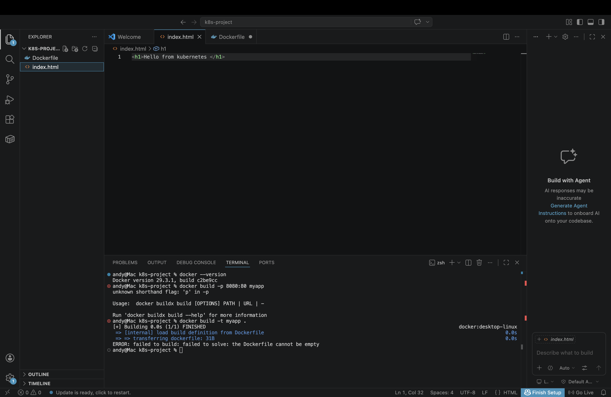

---

### 2. Dockerfile
A Dockerfile was created to define how the application is packaged into a container. It uses an Nginx base image and copies the HTML file into the web server directory.

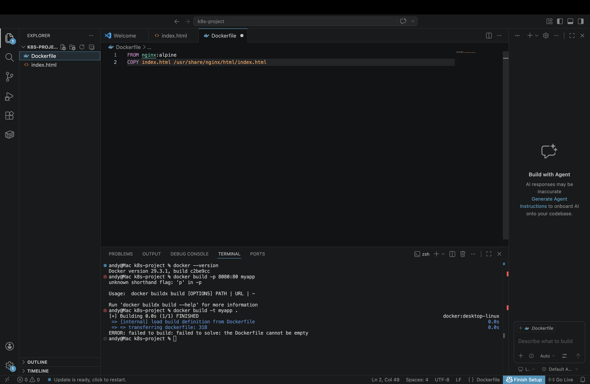

---

### 3. Docker Build Success
The Docker image was successfully built using the Dockerfile. This confirms that the application can be packaged into a container.

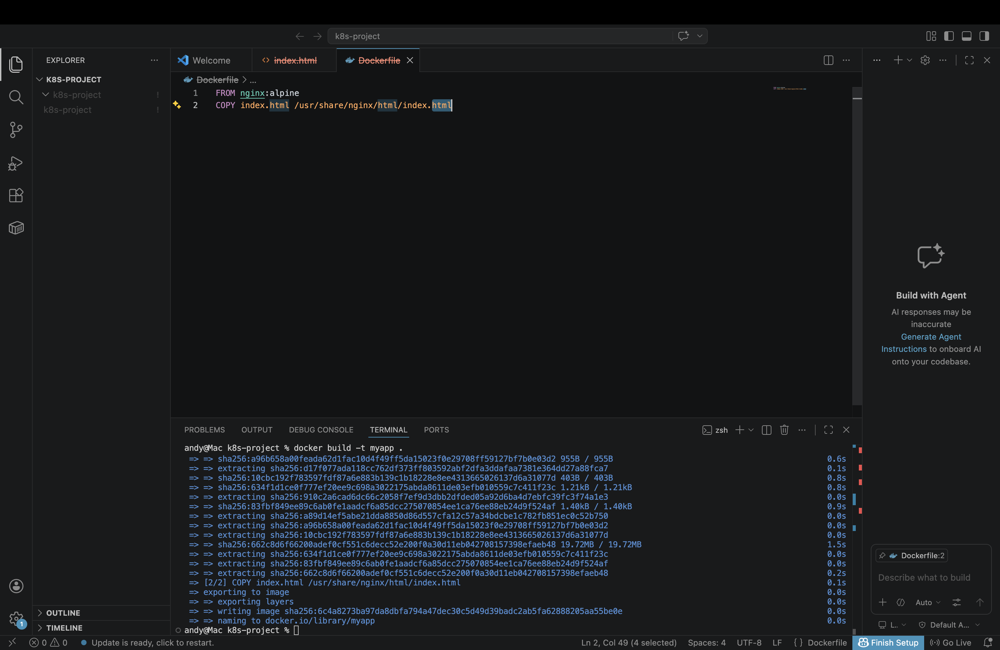

---

### 4. Container Running
The Docker container was started, exposing port 80 from the container to port 8080 on the host machine.

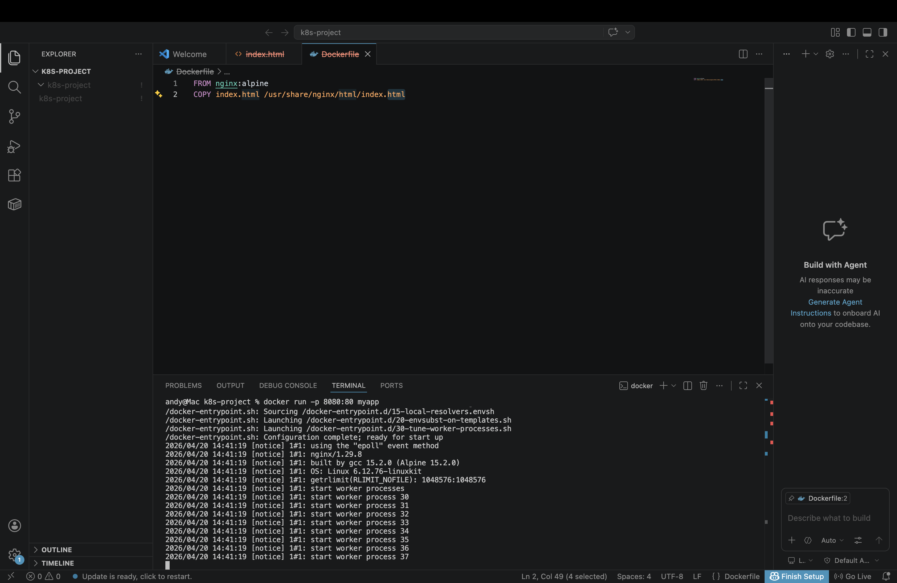

---

### 5. Application Running (Docker)
The application is accessible in the browser using Docker, confirming the container is functioning correctly.

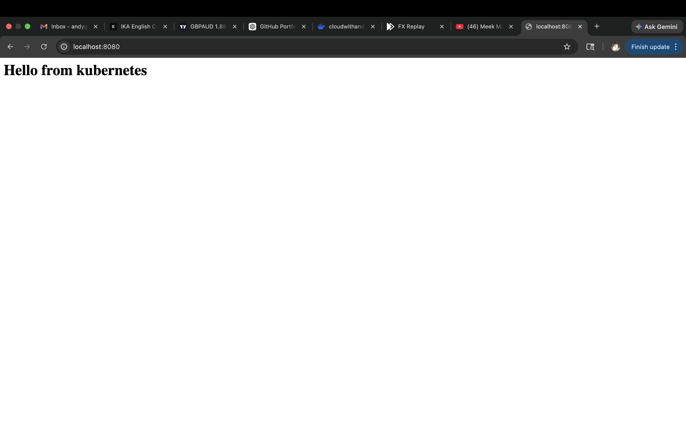

---

### 6. Minikube Cluster Initialization
A local Kubernetes cluster was initialized using Minikube. The node is in a Ready state, confirming the cluster is operational.

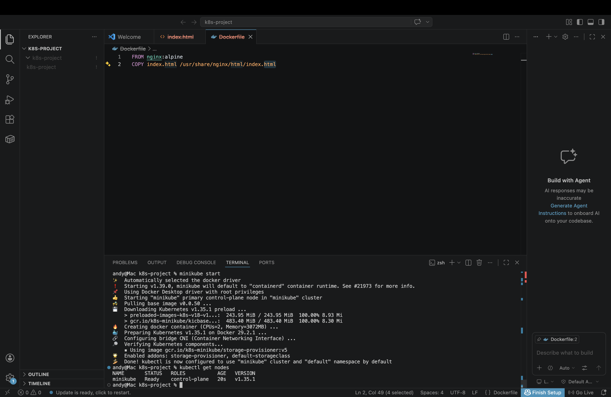

---

### 7. Deployment Creation
A Kubernetes deployment was created using the Docker image. Initially, the deployment shows that the pod is not available because the image was not yet accessible within the cluster.

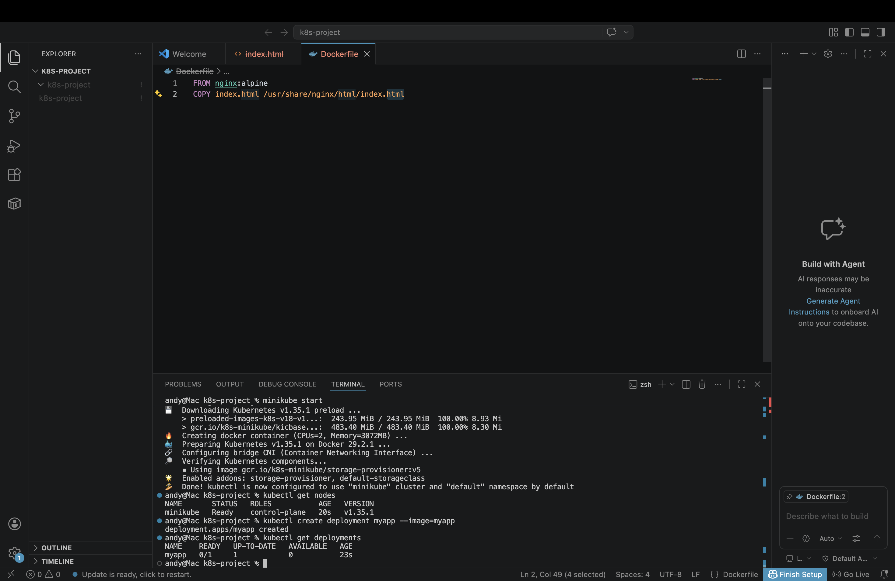

---

### 8. Pod Running
After loading the Docker image into Minikube and updating the deployment configuration, the pod is successfully running.

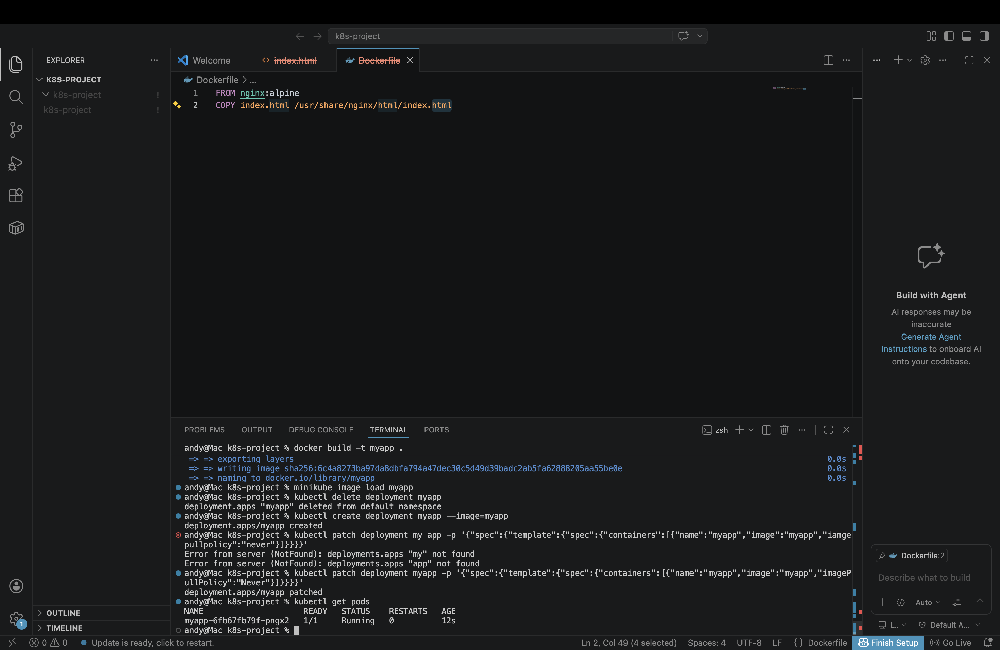

---

### 9. Service Exposure
The deployment was exposed using a NodePort service, allowing external access to the application from outside the cluster.

---

### 10. Minikube Service URL
Minikube generated a URL that provides access to the application through the Kubernetes service.

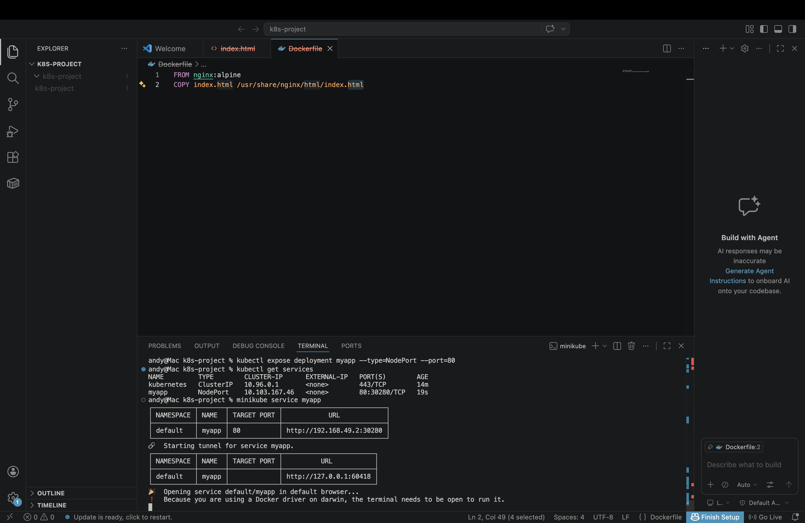

---

### 11. Application Running in Kubernetes
The application is successfully running and accessible in the browser through the Kubernetes cluster, completing the full deployment workflow.

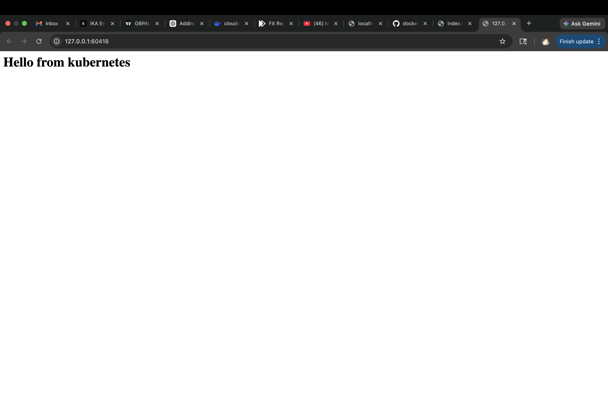

---

### 12. Local Docker Images
Verified that the Docker image was successfully built and available locally.

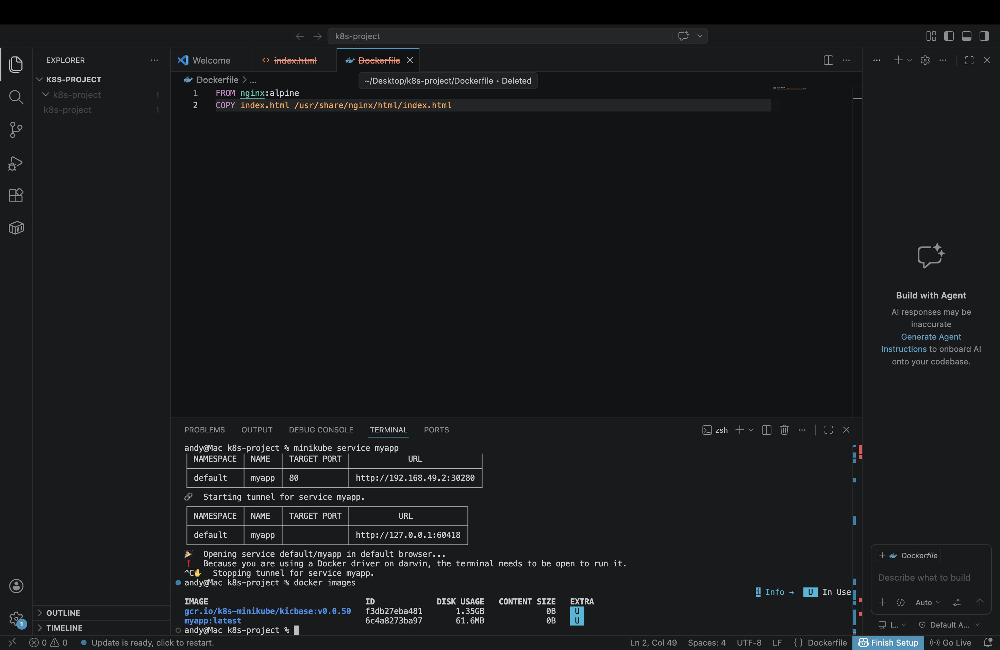

---

### 13. Docker Login
Authenticated to Docker Hub to enable pushing images to the remote registry.

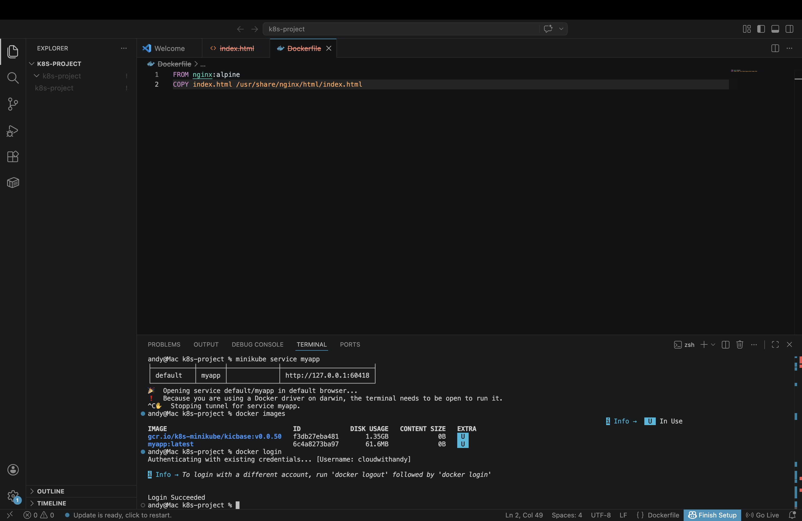

---

### 14. Image Tagging
Tagged the local Docker image with the Docker Hub repository name to prepare it for upload.

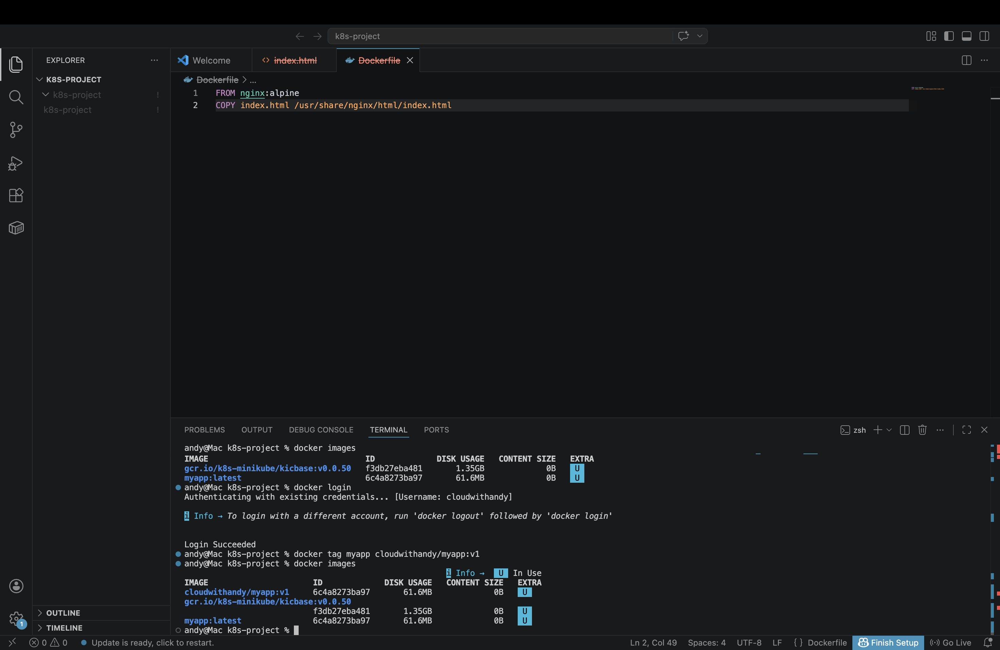

---

### 15. Docker Push
Pushed the Docker image to Docker Hub. The output confirms successful upload of image layers.

---

### 16. Docker Pull
Pulled the image from Docker Hub to verify it can be retrieved from the registry.

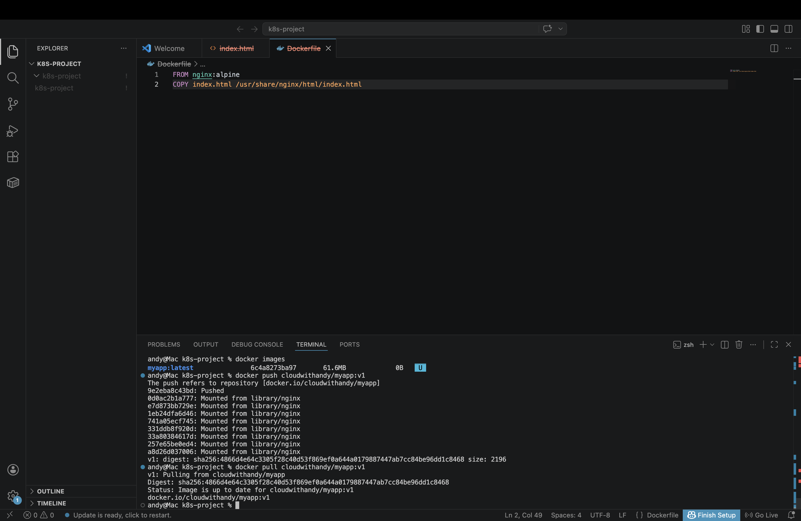

---

### 17. Container Running from Registry
Started a container using the image from Docker Hub and verified it is running.

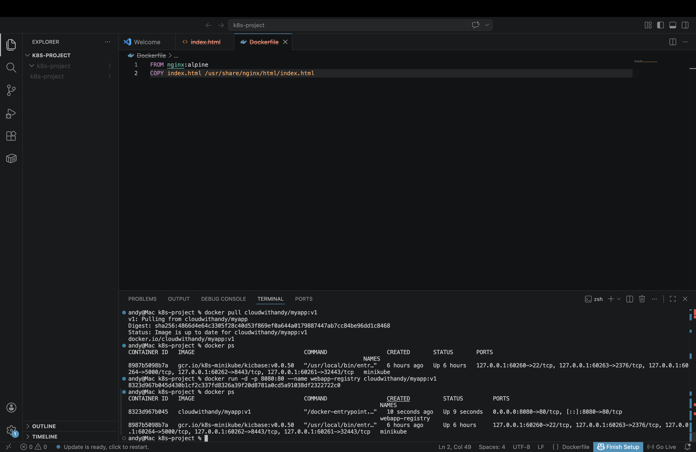

---

### 18. Application Running from Registry
Accessed the application in the browser using localhost, confirming successful deployment from the Docker registry.

